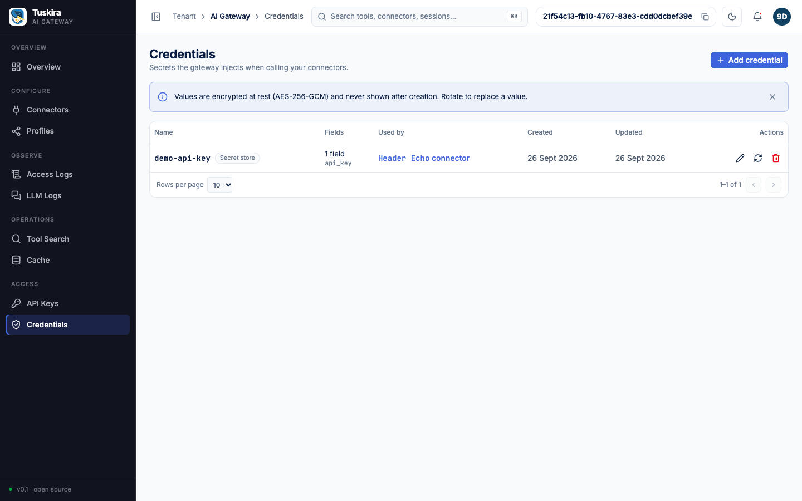

# 06 - Credentials and header injection

## Goal

Store a backend API key **once**, as a credential, and have the gateway
inject it into every call to a connector -- so the console and the API
only ever show `***` for it, while the backend receives the real value.
Along the way, show the other two ways a connector's outbound headers get
their values (a fixed static value, and the caller's own identity), and
`tool_arg_overrides`: a constant the gateway stamps onto a tool's
arguments server-side, overwriting whatever the caller sent.

In plain words:

- A **credential** is the secret, stored once, encrypted
  (AES-256-GCM, keyed by `GATEWAY_MASTER_KEY`). Nothing ever reads it back
  in the clear through the API -- only a `field_names` list and metadata.
- A **header config** on a connector means "put credential X's field Y in
  header Z on every call to this backend" (or a fixed value, or the
  caller's own identity -- see below). The caller never holds the
  backend's key; it never leaves the gateway.

## Prerequisites

- 01-quickstart, with `GATEWAY_ADMIN_KEY` exported (or let this script
  bootstrap its own -- see below)
- `docker`, `curl`, `jq`, `python3` -- the last one runs the tiny
  echo MCP server this example registers as a connector

## What this shows

- **`static`** -- a fixed value on the connector itself: `X-Static-Env: demo`.
- **`token_field`** -- one field of the caller's own authenticated
  identity, forwarded to the backend: `X-Caller` carries the calling
  API key's `subject`.
- **`external` / `secret_store`** -- `X-Backend-Key` is resolved at call
  time from the credential stored in step 2 below. The connector's
  metadata never holds the secret itself, only a `{credential, field}`
  reference to it.
- **Masking.** `GET /connectors/{id}` replaces a `static` header's value
  and every value inside an `external` header's `config` object with
  `"***"` -- uniformly, whether or not that particular value is actually
  sensitive (`maskConnectorMetadata`,
  `internal/api/handlers/connectors.go`). That's why `X-Static-Env`'s
  plain `"demo"` reads back masked too, same as the credential reference.
- **A masked round trip is safe.** Sending a connector's own masked GET
  body back on a `PUT` does not overwrite the real values with the
  literal string `"***"` -- `Update` unmasks first, restoring every
  `"***"` from what's already stored (`unmaskHeaderConfigs`, same file).
- **`tool_arg_overrides`** -- `echo-args`' `region` argument is stamped
  to `"eu-west-1"` on every call to it, overwriting anything the caller
  supplies. The advertised tool schema drops `region` entirely
  (`scrubOverridden`, `internal/dataplane/client/ops.go`), so nothing
  invites a model to guess at it.
- **The caller's own gateway credential is never forwarded.** The
  `Authorization: Bearer gk_...` a client sends to authenticate to the
  gateway itself is not copied onto the backend request -- confirmed
  below by capturing the exact headers the backend received.

## Steps

```sh
./run.sh
```

Safe to re-run: every step checks current state first and reuses or
rotates it instead of failing or duplicating work. `GATEWAY_ADMIN_KEY`,
if already exported, is reused as-is.

What `run.sh` does, in order:

**1. Start the `header-echo` MCP server** (this example's own tiny
backend, stdlib-only Python, Streamable HTTP) on port `23015`. It exposes
two tools: `headers`, which returns the HTTP headers it received, and
`echo-args`, which returns the tool arguments it received -- both are how
this example *proves* what the gateway actually sent, rather than taking
it on faith:

```sh
python3 header-echo-server.py 23015 &
echo $! > .header-echo.pid
```

If something is already listening on `:23015`, `run.sh` reuses it.

**2-4. Bring up the compose stack, check health on all three planes, and
bootstrap an admin key.** Identical to 01-quickstart's steps 2-4 -- see
[01-quickstart/README.md](../01-quickstart/README.md) for the full detail.

**5. Store the backend's API key as a credential, once.**
`POST /credentials` is not idempotent by name -- a second `POST` for a
name already in the tenant is a `409` (`internal/secrets/store.go`'s
`Create` wraps the unique-constraint violation as `store.ErrConflict`).
`run.sh` treats that `409` as "already exists" and rotates the payload
with `PUT` instead:

```sh
curl -X POST http://localhost:8081/api/v1/credentials \
  -H "Authorization: Bearer $GATEWAY_ADMIN_KEY" -H "Content-Type: application/json" \
  -d '{"name": "06-backend-key", "type": "api_key",
       "payload": {"api_key": "demo-1234567890"}}'
# -> 201, or 409 if it already exists

# on 409, rotate instead:
curl -X PUT http://localhost:8081/api/v1/credentials/06-backend-key \
  -H "Authorization: Bearer $GATEWAY_ADMIN_KEY" -H "Content-Type: application/json" \
  -d '{"payload": {"api_key": "demo-1234567890"}}'
```

The value (`demo-$(date +%s)`) is a placeholder generated fresh each run
-- never a real secret -- so later steps that check "the backend saw
exactly this value" are checking something real, not matching a
hardcoded string by luck.

**6. Register (or update) the `header-echo` connector**, pointing at the
server from step 1 (`host.docker.internal` is how the gateway container
reaches the host machine), with three headers and one argument override:

```sh
curl -X PUT http://localhost:8081/api/v1/connectors/$CONNECTOR_ID \
  -H "Authorization: Bearer $GATEWAY_ADMIN_KEY" -H "Content-Type: application/json" \
  -d '{
        "name": "Header Echo",
        "slug": "header-echo",
        "endpoint": "http://host.docker.internal:23015/mcp",
        "metadata": {
          "headers": {
            "X-Backend-Key": {"type": "external", "provider": "secret_store",
                               "config": {"credential": "06-backend-key", "field": "api_key"}},
            "X-Caller":      {"type": "token_field", "field": "subject"},
            "X-Static-Env":  {"type": "static", "value": "demo"}
          },
          "tool_arg_overrides": {
            "echo-args": {"region": "eu-west-1"}
          }
        }
      }'
```

`run.sh` looks the connector up by slug first (same pattern as
01-quickstart's connector and 05-profiles' profiles) and `PUT`s this same
body whether it just created the connector or found it already there --
`PUT` is a full replace of `name`/`endpoint`/`timeout_ms`, and only
touches `metadata` when it's sent, so re-sending it is naturally
idempotent.

**7. Probe health and discover tools**, exactly like 01-quickstart's step
6 -- `run.sh` asserts exactly 2 tools are discovered: `headers` and
`echo-args`.

**8. Confirm the console/API never show the secret.**
`GET /connectors/{id}` masks both the credential reference and the
static value:

```sh
curl http://localhost:8081/api/v1/connectors/$CONNECTOR_ID \
  -H "Authorization: Bearer $GATEWAY_ADMIN_KEY"
# -> metadata.headers["X-Backend-Key"].config == {"credential": "***", "field": "***"}
# -> metadata.headers["X-Static-Env"].value   == "***"
```

`run.sh` also greps the whole response for the generated secret value and
fails if it appears anywhere.

**9. MCP handshake** (`initialize` -> `notifications/initialized`), same
as 01-quickstart, authenticated as the admin key -- this example needs no
separate agent key or profile, since it isn't demonstrating access
scoping (see 05-profiles for that).

**10. `tools/list` -- both tools advertised, `region` scrubbed.**
`echo-args`' advertised `inputSchema.properties` does not list `region`
at all (it's a server-stamped constant, not something a caller should be
guessing at), while `q` -- the untouched argument -- still is:

```sh
curl http://localhost:8080/mcp \
  -H "Authorization: Bearer $GATEWAY_ADMIN_KEY" -H "Mcp-Session-Id: $SESSION_ID" \
  -H "Content-Type: application/json" \
  -d '{"jsonrpc":"2.0","id":2,"method":"tools/list"}'
# -> header-echo__headers, header-echo__echo-args
# -> echo-args' inputSchema.properties has "q" but not "region"
```

**11. `tools/call header-echo__headers` -- proves header injection, and
that the caller's own key is never forwarded:**

```sh
curl http://localhost:8080/mcp \
  -H "Authorization: Bearer $GATEWAY_ADMIN_KEY" -H "Mcp-Session-Id: $SESSION_ID" \
  -H "Content-Type: application/json" \
  -d '{"jsonrpc":"2.0","id":3,"method":"tools/call","params":{"name":"header-echo__headers","arguments":{}}}'
```

`run.sh` parses the backend's own account of what it received and
asserts:

- `X-Backend-Key` equals the exact value stored in step 5 (the secret,
  resolved and injected -- never seen by the caller).
- `X-Static-Env` equals `demo`.
- `X-Caller` is non-empty (the admin key's own principal id).
- `Authorization` is **absent**. The caller authenticates to the gateway
  with its own `Authorization: Bearer gk_...`; that header is never
  copied onto the outbound backend request.
  `internal/dataplane/client/client.go`'s `exchange()` builds the
  backend request from scratch through `newRequest`
  (`http.NewRequestWithContext`) and only ever sets `Content-Type`,
  `Accept`, the protocol-version header, a `traceparent` when the call
  carries a trace, the connector's own configured headers
  (`applyConnectorHeaders`), and finally the gateway-owned
  `X-Tenant-Id`/`Mcp-Session-Id` -- there is no line anywhere in those
  functions that reads or copies the inbound `Authorization` header. Its absence isn't stripped at the last
  moment; it's just never written.

**12. `tools/call header-echo__echo-args` -- proves the argument
override:**

```sh
curl http://localhost:8080/mcp \
  -H "Authorization: Bearer $GATEWAY_ADMIN_KEY" -H "Mcp-Session-Id: $SESSION_ID" \
  -H "Content-Type: application/json" \
  -d '{"jsonrpc":"2.0","id":4,"method":"tools/call","params":{"name":"header-echo__echo-args","arguments":{"region":"us-east-1","q":"x"}}}'
```

The caller asks for `region=us-east-1`; `run.sh` asserts the backend saw
`region=eu-west-1` instead (`router.StampOverrides` overwrites it *after*
routing) and `q=x` unchanged (an argument with no override just passes
through).

**13. A masked round trip does not corrupt the stored secret.** Step 8's
masked response -- credential/field/value already `"***"` -- is sent
straight back on a `PUT`, unchanged:

```sh
curl -X PUT http://localhost:8081/api/v1/connectors/$CONNECTOR_ID \
  -H "Authorization: Bearer $GATEWAY_ADMIN_KEY" -H "Content-Type: application/json" \
  -d "$MASKED_BODY"   # exactly what step 8's GET returned
```

`Update` (`internal/api/handlers/connectors.go`) runs
`unmaskHeaderConfigs` before saving: every `"***"` in the incoming body is
replaced by the value already on file, so the literal placeholder is
never what gets stored. `run.sh` re-calls `headers` afterward and asserts
`X-Backend-Key` still equals the exact secret from step 5 -- proving the
round trip is a no-op, not a silent corruption.

## Expected output

Abridged to the assertions this example is about:

```
check: console/API mask the credential reference and the static value
  -> X-Backend-Key: {"config":{"credential":"***","field":"***"},"provider":"secret_store","type":"external"}
  -> X-Static-Env: {"type":"static","value":"***"} (masked too -- see note above)
  -> generated secret (demo-1758901234) is absent from the API response
...
check: MCP tools/call header-echo__headers
  ok · X-Backend-Key = demo-1758901234
  ok · X-Static-Env = demo
  ok · X-Caller = 3f9e7b2a-... (the admin key's own principal id)
  ok · Authorization was NOT forwarded to the backend
check: MCP tools/call header-echo__echo-args
  ok · region = eu-west-1 (server-side override beat the caller's 'us-east-1')
  ok · q      = x (untouched argument passed through)
check: a masked round trip (GET, then PUT back unchanged)
  -> PUT the masked body back unchanged
  -> the stored secret survived the round trip -- the backend still sees the real value, not "***"
```

`run.sh` finishes by printing the console URL and the admin key once:

```
================================================================
06-credentials-and-headers passed.
Console:     http://localhost:8081
Admin key:   gk_...
Credential:  06-backend-key (masked in the API/UI, plain to the backend)
Connector:   header-echo (id ...)
================================================================
```



## Cleanup

```sh
# Stop the header-echo server started in step 1
kill "$(cat .header-echo.pid)" 2>/dev/null || true
rm -f .header-echo.pid .header-echo.log

# Stop the gateway stack (add -v to also drop its Postgres volume,
# which removes the credential and connector this example created)
docker compose -f ../../deploy/docker-compose.yml down
```

`down` alone leaves the credential and connector in the volume for the
next run to reuse (rotated/updated in place, not duplicated) -- only
`down -v` wipes them for good.
