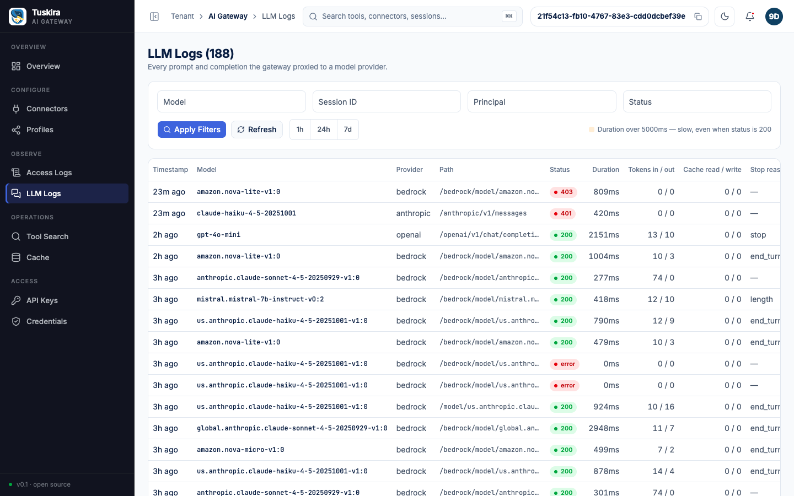

# 07 - LLM passthrough (BYOK)

## Goal

The same client code -- a `curl` call or an unmodified `anthropic`/`openai`
SDK client -- hitting **Anthropic, OpenAI, Gemini, and Bedrock** through one
gateway (`:8082`), each with **the caller's own provider credentials**
(BYOK: bring your own key). The gateway sits in the middle only to
authenticate itself, forward the request byte-for-byte, and capture tokens +
estimated cost per call. Streaming works unchanged.



## What this shows

- **BYOK, two separate credentials, two separate headers.** Your provider
  key (`x-api-key`, `Authorization: Bearer sk-...`, `x-goog-api-key`, or AWS
  SigV4 credentials) rides through to the real provider untouched. The
  gateway's own key travels separately, on `X-Gateway-Key` (or
  `Authorization: Bearer gk_...`) -- the two never collide, even when a
  provider also uses `Authorization` for its own key (OpenAI, Bedrock's
  pre-signed flow).
- **Bedrock, three credential flows**: pre-signed passthrough (A), the
  caller's own AWS keys signed by the gateway (B), or the gateway's own AWS
  identity (C).
- **Streaming is relayed frame-by-frame**, not buffered.
- **Every call is captured** with tokens, cost, and the provider's own
  request id -- visible on the console's **LLM Logs** page.

This example's `run.sh` runs in two tiers, because this repo tests against
real services, never mocks (there is no fake upstream anywhere here):

1. **Always, no provider keys needed (this is what CI runs).** For each
   provider, a request goes through the gateway to the REAL provider with a
   deliberately **bogus** provider key, and `run.sh` asserts that the
   provider's OWN error comes back (see "What CI checks without keys"
   below). No `ANTHROPIC_API_KEY`/`OPENAI_API_KEY`/etc. is needed for this
   tier at all.
2. **Only if you export real keys.** For each of
   `ANTHROPIC_API_KEY`/`OPENAI_API_KEY`/`GEMINI_API_KEY`/AWS credentials
   that's actually set, `run.sh` makes a real call and asserts a real
   answer with real token counts. Anything not set is skipped with a
   `skipped: X not set` line -- this tier is expected to be partial almost
   everywhere, including in this repo's own CI.

## Prerequisites

- Docker and the `docker compose` plugin
- `curl` and `jq`
- Nothing else for tier 1 (the no-keys checks) -- no API keys, no cloud
  account.
- For tier 2 (optional, BYOK): your own `ANTHROPIC_API_KEY`, `OPENAI_API_KEY`,
  `GEMINI_API_KEY`, and/or AWS credentials
  (`AWS_ACCESS_KEY_ID`/`AWS_SECRET_ACCESS_KEY`/`AWS_SESSION_TOKEN`, or
  `AWS_PROFILE` with the `aws` CLI installed).
- For the `sdk/*.py` snippets specifically: Python 3 and
  `pip install anthropic` / `pip install openai`.

## Steps

Run the whole thing with:

```sh
./examples/07-llm-passthrough/run.sh
```

It's safe to re-run, with the one exception 05-profiles and 04-python-agent
also have: the agent API key (`07-llm-passthrough-agent`) is minted fresh
every run, since a key's plaintext is only ever returned once.

What `run.sh` does, in order:

**1. Bring up the compose stack and check health** on the control plane
(`:8081`, needed to bootstrap keys) and the LLM plane (`:8082`, what this
example actually exercises) -- same pattern as 01-quickstart, minus the MCP
plane this example doesn't use.

**2. Bootstrap an admin key**, same `--force`-fallback pattern as every
other example (see [01-quickstart/README.md](../01-quickstart/README.md)).

**3. Mint a fresh agent-role API key.** `llmplane.Handler` requires
`llm.access` (`internal/llmplane/server.go`, `requirePermission`), which
admin's `*` and agent's `llm.*` both grant (a viewer key gets `403`); an
agent key is the least privilege that can reach it (`pkg/auth`:
`"agent": {"mcp.*", "llm.*", "*.read"}`).

**4. Tier 1 -- bogus-key checks against every provider** (see the routes and
env below). **5. Tier 2 -- real-key checks**, skipped per-provider when
that provider's key isn't set. **6. An LLM Logs read**
(`GET /api/v1/analytics/llm-logs`), served from ClickHouse with the
`analytics` profile, else from the Postgres capture table.

### Provider routes

Every call is `POST http://localhost:8082{path}` carrying **both** the
gateway's own key and the caller's own provider key -- never just one.
Verified against `internal/llmplane/provider.go`'s `pickProvider`
(prefix routing; Anthropic's bare-route exception,
`isAnthropicNativePath`) and each provider's own file:

| Provider | Path | Your key (BYOK) | Gateway's own key |
|---|---|---|---|
| Anthropic | `POST /anthropic/v1/messages` (also bare `/v1/messages`, `/v1/complete` -- what Claude Code's `ANTHROPIC_BASE_URL` sends) | `x-api-key` | `X-Gateway-Key` (or `Authorization: Bearer gk_...`) |
| OpenAI | `POST /openai/v1/chat/completions` (prefix-only -- no bare route, since `/v1/chat/completions` would collide with other providers' shared `/v1` namespace) | `Authorization: Bearer sk-...` | `X-Gateway-Key` (Authorization is already OpenAI's) |
| Gemini | `POST /gemini/v1beta/models/{model}:generateContent` (prefix-only) | `x-goog-api-key` | `X-Gateway-Key` |
| Bedrock, Flow A (pre-signed) | `POST /bedrock/model/{id}/{action}` (also bare `/model/{id}/{action}`); `{action}` is `invoke`, `invoke-with-response-stream`, `converse`, or `converse-stream` -- the gateway forwards whatever action segment it's given (`bedrock.go`'s `parseModelID`/`buildPassthrough`) | Already-signed `Authorization: AWS4-HMAC-SHA256 ...` | `X-Gateway-Key` |
| Bedrock, Flow B (client keys) | same path | `X-Bedrock-Access-Key-Id` + `X-Bedrock-Secret-Access-Key` [+ `X-Bedrock-Session-Token`], or `X-Bedrock-Role-Arn` [+ `X-Bedrock-External-Id`] | `X-Gateway-Key` |
| Bedrock, Flow C (gateway identity) | same path | none -- the gateway's own default AWS credential chain | `X-Gateway-Key` |

`X-Bedrock-Region` overrides the gateway's configured default region per
request in Flows B/C (`bedrock.go`'s `regionFor`). All four
providers are enabled by default in `deploy/docker-compose.yml`
(`GATEWAY_LLM_PROXY_BEDROCK_ENABLED`,
`GATEWAY_LLM_PROXY_PROVIDERS_OPENAI_ENABLED`,
`GATEWAY_LLM_PROXY_PROVIDERS_GEMINI_ENABLED` all default `"true"`; Anthropic
has no enable flag -- it's on whenever the LLM plane itself is).

### What CI checks without keys

`run.sh`'s tier 1 (also runnable by hand as `curl/*.sh` with a bogus key)
sends the gateway's real agent key plus a deliberately bogus provider
credential straight through to the real provider, and asserts:

- **`GET /health` on `:8082`** answers `{"status":"ok","plane":"llm",...}`.
- **No gateway key at all** -> the gateway's OWN `401`
  (`{"error":{"type":"authentication_error","message":"authentication
  required"}}`) -- rejected before ever reaching a provider.
- **A bare unrouted path** (`POST /v1/chat/completions`, with a valid
  gateway key) -> `404` (`{"error":{"message":"no provider for route
  /v1/chat/completions","type":"not_found_error"},...}`) -- proving auth and
  routing fail independently: the key was accepted, routing wasn't.
- **Anthropic**, bogus `x-api-key` -> `401`,
  Anthropic's own `authentication_error` (`"API key is invalid."`).
- **OpenAI**, bogus `Authorization` -> `401`, OpenAI's own
  `invalid_api_key` (`"Incorrect API key provided: ..."`).
- **Gemini**, bogus `x-goog-api-key` -> `400`, Gemini's own
  `API_KEY_INVALID` (`"API key not valid. Please pass a valid API key."`).
- **Bedrock Flow B**, bogus AWS keys (`X-Bedrock-Region: us-east-1` +
  fake `X-Bedrock-Access-Key-Id`/`Secret-Access-Key`) -> `403`, AWS's own
  `UnrecognizedClientException` (`X-Amzn-Errortype` response header;
  body `{"message":"The security token included in the request is
  invalid."}`).

Getting the provider's OWN error back -- not a gateway-side error, and not
a generic proxy failure -- is the proof the request reached the real
provider with the caller's credential intact. Combined with the "no
gateway key" check above (denied by the gateway itself, before any
provider is involved), this demonstrates the two credentials are handled
completely separately: the gateway never needs, sees as valid, or forwards
its own key to a provider, and a provider never sees the gateway's key.

All of the above was run by hand against a live local stack (not just
inferred from the code) to write these assertions.

### Real-key tier

Export any subset and re-run `./run.sh`:

```sh
export GATEWAY_URL=http://localhost:8082
export GATEWAY_KEY=gk_...                 # printed at the end of a run.sh pass
export ANTHROPIC_API_KEY=sk-ant-...
export OPENAI_API_KEY=sk-...
export GEMINI_API_KEY=...
export AWS_ACCESS_KEY_ID=... AWS_SECRET_ACCESS_KEY=... AWS_SESSION_TOKEN=...
# -- or -- export AWS_PROFILE=... (resolved via `aws configure export-credentials`)
```

Each present key runs its `curl/*.sh` script for real (OpenAI also runs its
streaming variant) and asserts HTTP 200 plus the expected response shape
(`.content[0].text`, `.choices[0].message.content`,
`.candidates[0].content.parts[0].text`, `.output.message.content`), then
prints the tokens the gateway captured. Bedrock's Flow C
(`curl/bedrock-C-gateway.sh`, the gateway's own AWS identity) is **not**
asserted by `run.sh` -- it depends on whatever AWS environment the
already-running gateway container itself was started with, which this
script has no way to inspect or control; run it by hand once you know your
gateway has one.

### SDK snippets

`sdk/anthropic_sdk.py` and `sdk/openai_sdk.py` are ~25-line, runnable
scripts showing the same BYOK pattern through the official SDKs instead of
raw `curl` -- `base_url` + `default_headers`, nothing else changes:

```sh
pip install anthropic
GATEWAY_KEY=$GATEWAY_KEY ANTHROPIC_API_KEY=sk-ant-... python3 examples/07-llm-passthrough/sdk/anthropic_sdk.py

pip install openai
GATEWAY_KEY=$GATEWAY_KEY OPENAI_API_KEY=sk-... python3 examples/07-llm-passthrough/sdk/openai_sdk.py
```

Note OpenAI's `base_url` must be `.../openai/v1` (the SDK appends only
`/chat/completions`), while Anthropic's is bare (the SDK appends
`/v1/messages` itself) -- each script's docstring explains why, citing the
same `copyHeaders`/`isGatewayBearer` header-separation logic as the route
table above.

## Expected output

Tier 1 (no keys), against a live stack:

```
check: LLM plane /health
  -> {"limits":{"budget_denials":0,"rpm_denials":0},"plane":"llm","status":"ok","version":"dev"}
check: no gateway key at all -> 401 ...
  -> [no gateway key] HTTP 401: {"error":{"type":"authentication_error","message":"authentication required"}}
check: bare unrouted path (/v1/chat/completions) -> 404 ...
  -> [unrouted path] HTTP 404: {"error":{"message":"no provider for route /v1/chat/completions","type":"not_found_error"},...}
check: Anthropic, bogus x-api-key -> Anthropic's own 401 authentication_error
  -> [anthropic bogus key] HTTP 401: {"type":"error","error":{"type":"authentication_error","message":"API key is invalid."},"request_id":null}
check: OpenAI, bogus Authorization -> OpenAI's own 401 invalid_api_key
  -> [openai bogus key] HTTP 401: {"error":{"message":"Incorrect API key provided: ...","type":"invalid_request_error","code":"invalid_api_key",...}}
check: Gemini, bogus x-goog-api-key -> Gemini's own 400 API_KEY_INVALID
  -> [gemini bogus key] HTTP 400: {"error":{"code":400,"message":"API key not valid. Please pass a valid API key.",...,"reason":"API_KEY_INVALID",...}}
check: Bedrock Flow B, bogus AWS keys -> AWS's own signature-rejection error
  -> X-Amzn-Errortype: UnrecognizedClientException:http://internal.amazon.com/coral/com.amazon.coral.service/
  -> [bedrock bogus keys] HTTP 403: {"message":"The security token included in the request is invalid."}

Tier 1 passed: ...
```

Tier 2, once you export real keys, adds a "tokens" line per provider and
the last few LLM Logs rows.

Within a few seconds of a real call (the ClickHouse sink flushes every 5 s
or 100 records, `sinks.clickhouse.flush_interval`/`batch_size`; LLM Logs
from Postgres is immediate), it also shows up in the console:

- **LLM Logs** (`/llm-logs`) -- one row per call: provider, model, tokens,
  cost, status.
- **Overview** -- KPI tiles (LLM Agent Calls, Total Tokens, Total Cost)
  and the LLM Usage table bump.
- `GET /api/v1/analytics/llm-logs?limit=10` -- the same rows as JSON.

The Overview tiles require the ClickHouse sink:

```sh
GATEWAY_SINKS_CLICKHOUSE_ENABLED=true docker compose -f deploy/docker-compose.yml --profile analytics up -d
```

Without it, `GET /api/v1/analytics/overview` answers `404`
(`analytics requires the ClickHouse sink`). LLM Logs and
`GET /api/v1/analytics/llm-logs` work either way: without ClickHouse they
read the Postgres capture table (`llm_proxy.capture.store: postgres`, the
compose default).

## How the gateway priced the call (four-line summary)

- **Anthropic / Bedrock** -- cache tokens are reported separately from
  input; a 1-hour cache write bills at 2x base input, 5-min at 1.25x. Web
  search: $10 / 1,000 requests.
- **OpenAI / Gemini** -- cached tokens are folded into input; the base rate
  applies to `input - cached`, the cached slice to `cache_read`.
- **Long context** -- Claude Sonnet 4.5+ and Gemini Pro bill the whole
  request at the `above_200k` rate once the prompt passes 200K tokens.
- **Bedrock inference profiles** -- the region prefix (`us.`/`eu.`/`apac.`/
  `au.`/`jp.`/`global.`/`us-gov.`) is stripped for pricing lookup
  (`pkg/pricing/pricing.go`'s `reRegion`); the base model rate
  applies. Per-region premiums are provider-published; see the AWS Bedrock
  pricing page.

Full details: [`docs/llm-plane.md`](../../docs/llm-plane.md).

## Offloading bodies to S3/MinIO

This stack captures bodies (`GATEWAY_LLM_PROXY_CAPTURE_STORE_BODIES=true`)
inline in Postgres and ClickHouse. To keep long sessions' payloads out of
the capture rows, point `llm_proxy.capture.body_store` at a bucket; rows
then carry a `body_ref` (`s3://<bucket>/llm-bodies/<request_id>`) and the
LLM Logs detail drawer fetches the bodies back from the bucket. The bucket
must already exist.

```yaml
llm_proxy:
  capture:
    store_bodies: true
    body_store:
      type: s3
      inline_max_bytes: 0            # offload every call with a body
      s3:
        bucket: gateway-llm-bodies
        endpoint: http://minio:9000  # omit for AWS S3
        force_path_style: true       # MinIO needs path-style addressing
        access_key_id: minio         # omit both to use the AWS credential chain
        secret_access_key: minio12345
```

or, as env vars on the `gateway` service in `deploy/docker-compose.yml`:

```sh
GATEWAY_LLM_PROXY_CAPTURE_BODY_STORE_TYPE=s3
GATEWAY_LLM_PROXY_CAPTURE_BODY_STORE_S3_BUCKET=gateway-llm-bodies
GATEWAY_LLM_PROXY_CAPTURE_BODY_STORE_S3_ENDPOINT=http://minio:9000
GATEWAY_LLM_PROXY_CAPTURE_BODY_STORE_S3_FORCE_PATH_STYLE=true
GATEWAY_LLM_PROXY_CAPTURE_BODY_STORE_S3_ACCESS_KEY_ID=minio
GATEWAY_LLM_PROXY_CAPTURE_BODY_STORE_S3_SECRET_ACCESS_KEY=minio12345
```

If the bucket is unreachable, capture falls back to inline bodies and
`GET /api/v1/health` shows `sinks.body_store.fallbacks` climbing. Details:
[`docs/llm-plane.md#body-offload`](../../docs/llm-plane.md#body-offload).

## Cleanup

```sh
# Stop the gateway stack (add -v to also drop its Postgres volume)
docker compose -f deploy/docker-compose.yml down
```

Every re-run of this example mints one more `07-llm-passthrough-agent` API
key without revoking the previous one, same as 05-profiles/04-python-agent
-- harmless to leave, but to tidy up:

```sh
curl -sS -H "Authorization: Bearer $GATEWAY_ADMIN_KEY" \
  "http://localhost:8081/api/v1/api-keys?limit=500" \
  | jq -r '.items[] | select(.name=="07-llm-passthrough-agent") | .id' \
  | while read -r id; do
      curl -sS -X DELETE "http://localhost:8081/api/v1/api-keys/$id" \
        -H "Authorization: Bearer $GATEWAY_ADMIN_KEY"
    done
```

LLM calls land in Postgres `llm_calls` (durable) and, if the `analytics`
profile is up, ClickHouse `llm_calls` (dashboard) -- both are the audit
trail, not example state; delete with `DELETE FROM llm_calls WHERE
session_id LIKE '07-%'` if you want them gone.
