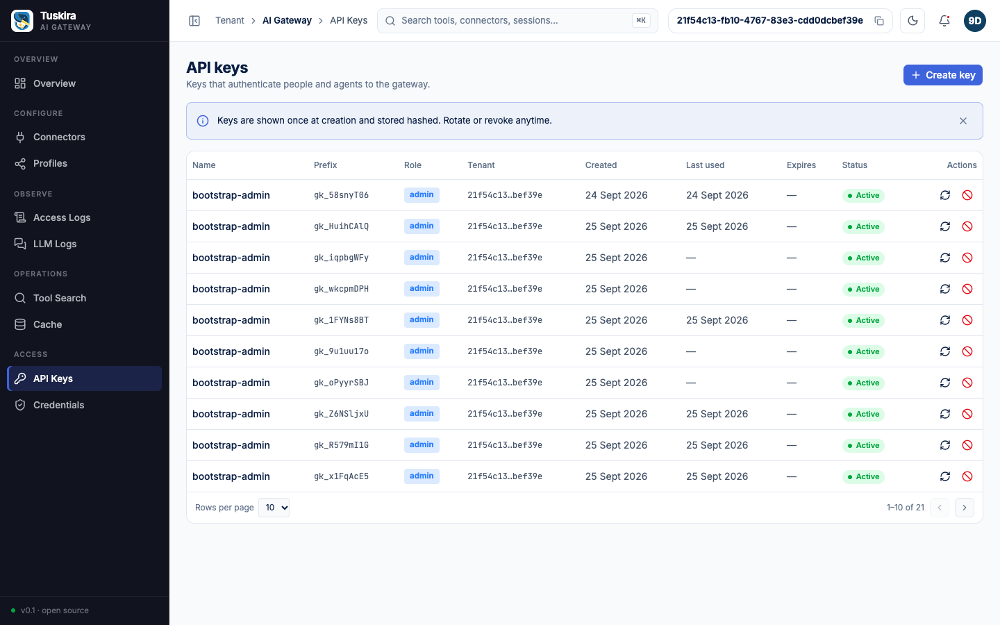

# 09 - Roles, keys, and rate limits

## Goal

Least privilege and key hygiene, end to end, against a real gateway:

- A custom **`reader`** role (`auth.roles`) that can read connectors but
  cannot write them, and cannot reach the MCP plane at all.
- The built-in **`agent`** role's blanket `*.read` grant, and the one
  route (`platform.admin`-gated `/tenants`) it deliberately doesn't cover.
- **Revoke** -- a deleted key is rejected on its very next request, not
  after some cache TTL expires.
- **Rotate** -- the old key dies, the new one works, both immediately.
- The control plane's **failed-auth lockout** -- 10 bad keys from one IP
  trip a 429 (with `Retry-After`) for every request from that IP,
  including ones carrying a perfectly valid key.



## Prerequisites

- Docker and the `docker compose` plugin
- `curl` and `jq`
- Nothing else: no MCP server to run locally (unlike 01-quickstart /
  05-profiles -- this example never calls a tool), no cloud account, no
  LLM provider credentials.

This example is self-contained: it does not assume any other example has
been run first.

## Steps

Run the whole thing with:

```sh
./examples/09-roles-keys-and-rate-limits/run.sh
```

It's safe to re-run: the roles overlay, the admin key, and the rate-limit
lockout are all re-derived from scratch every run. The one exception is
the `09-reader` / `09-agent` API keys, minted fresh every run -- see step 3.

What `run.sh` does, in order:

**1. Bring up the compose stack with the roles overlay.** The shipped
`deploy/docker-compose.yml` has no config-file mount by design (every
common knob is a `GATEWAY_*` env var) -- but a custom role
(`auth.roles`) is a map, which `internal/config`'s env-var overlay can't
reach (it only sets string/int/bool/duration/[]string leaves). The
rate-limit tuning could be env vars (`GATEWAY_AUTH_RATE_LIMIT_LOCKOUT=20s`),
but since a file is needed anyway this example keeps both in
[`config.roles.yaml`](config.roles.yaml). So this step layers on
[`docker-compose.roles.yml`](docker-compose.roles.yml), which mounts that
file and points `CONFIG_PATH` at it:

```sh
docker compose \
  -f deploy/docker-compose.yml \
  -f examples/09-roles-keys-and-rate-limits/docker-compose.roles.yml \
  up -d
```

`internal/config.Load` (`internal/config/config.go`) starts from
`Default()`, then unmarshals a config file **on top of** that struct --
unset fields keep their default, they aren't wiped out -- and applies
`GATEWAY_*` environment variables *after* the file. That means every
`GATEWAY_DATABASE_*`, `GATEWAY_AUTH_API_KEYS_ENABLED`, etc. env var the
shipped compose file already sets for `gateway` still wins, so
`config.roles.yaml` only needs to add the two things this example
introduces:

```yaml
auth:
  roles:
    reader:
      - "connector.read"
      - "profile.read"
      - "cache.read"
      - "analytics.read"
  rate_limit:
    max_failures: 10   # pinned explicitly, though it equals Default()
    lockout: 20s        # shortened from Default()'s 5m for this demo
```

A role name that doesn't collide with a built-in (`admin`,
`platform-admin`, `agent`, `viewer`, `interceptor`) is
**added** alongside them; a name that did collide would **replace** it
outright, not merge into it (`config.go`'s `Auth.Roles` doc comment;
merged in by `cmd/gateway/main.go`'s `run()`). `reader` is granted four
explicit permissions -- not a blanket `"*.read"` -- so the grant reads as
an audit list. It still can't reach `admin.manage` (api-keys and
credentials are admin-only regardless of any `*.read`-style grant --
`internal/api/handlers/apikeys.go`'s doc comment), `platform.admin`
(`/tenants` -- see step 5), or `mcp.access` (see step 4).

Compose recreates the `gateway` container automatically once its merged
config (env + the new volume) changes, so no `--force-recreate` is
needed -- here or when this step's changes are dropped again at the end.
`run.sh` waits for health on all three planes before continuing, exactly
like 01-quickstart/05-profiles.

**2. Bootstrap an admin API key.** Identical to 01-quickstart's step 4 --
see [01-quickstart/README.md](../01-quickstart/README.md) for the full
detail; `run.sh` reuses `GATEWAY_ADMIN_KEY` from the environment if it's
already set, and mints a fresh one with `--force` if the tenant already
has one.

**3. Mint the `09-reader` and `09-agent` API keys.** Not idempotent by
design, like 05-profiles' agent key -- a key's plaintext (`"key"`) is
only ever returned once, at creation
(`internal/api/handlers/apikeys.go`, `APIKeys.Create`), so there's
nothing to "look up and reuse". Every run mints a fresh pair:

```sh
curl -sSf -X POST http://localhost:8081/api/v1/api-keys \
  -H "Authorization: Bearer $GATEWAY_ADMIN_KEY" -H "Content-Type: application/json" \
  -d '{"name": "09-reader", "role": "reader"}'
# -> 201 {"id":"...", "name":"09-reader", "role":"reader",
#         "prefix":"gk_...", "key":"gk_...", ...}   <- "key" is the plaintext

curl -sSf -X POST http://localhost:8081/api/v1/api-keys \
  -H "Authorization: Bearer $GATEWAY_ADMIN_KEY" -H "Content-Type: application/json" \
  -d '{"name": "09-agent", "role": "agent"}'
```

A role name that is neither built in nor in `auth.roles` is rejected
here with `400 {"error":{"type":"validation_error","message":"role must
be one of: admin, agent, interceptor, platform-admin, reader, viewer"}}` (`internal/api/handlers/validate.go`,
`validateRole`) -- the set of acceptable roles is read live off the
running `Authorizer`, not hardcoded, so `reader` is only assignable
because step 1's overlay is already loaded by the time this step runs.

**4. Reader lens: connectors, and the MCP plane.** `reader`'s four
permissions include `connector.read` but not `connector.create`, so:

```sh
curl -sS -H "Authorization: Bearer $RKEY" http://localhost:8081/api/v1/connectors
# -> 200

curl -sS -X POST http://localhost:8081/api/v1/connectors \
  -H "Authorization: Bearer $RKEY" -H "Content-Type: application/json" \
  -d '{"name":"x","slug":"x","endpoint":"http://x/"}'
# -> 403 {"error":{"type":"permission_error","message":"insufficient permissions"}}
```

None of `reader`'s four patterns match `mcp.access` -- the one permission
`internal/dataplane/transport/auth.go`'s `AuthMiddleware` requires for
the MCP plane -- so an MCP request authenticated as `reader` is denied
*there*, before it ever reaches a connector or a tool:

```sh
curl -sS -X POST http://localhost:8080/mcp \
  -H "Authorization: Bearer $RKEY" -H "Content-Type: application/json" \
  -H "Accept: application/json, text/event-stream" \
  -d '{"jsonrpc":"2.0","id":1,"method":"initialize","params":{"protocolVersion":"2025-06-18","capabilities":{},"clientInfo":{"name":"09","version":"1"}}}'
# -> HTTP 403, body: {"jsonrpc":"2.0","error":{"code":-32006,"message":"role does not permit MCP access"}}
```

This is a genuinely different shape from 05-profiles' `-32003` (tool not
allowed by profile): that one is an HTTP **200** carrying a JSON-RPC
`"error"` (an authenticated, authorized caller whose *profile* doesn't
grant a tool), while this is a non-200 **HTTP status** carrying the same
JSON-RPC error shape (the caller never gets far enough to reach profile
scoping at all). `run.sh` checks the HTTP status and the error code
together for exactly this reason.

**5. Agent lens: the built-in `*.read` grant, and its one carve-out.**
The built-in `agent` role is `{"mcp.*", "llm.*", "*.read"}`
(`pkg/auth/auth.go`, `NewRoleAuthorizer`). `"*.read"` matches
`connector.read` (an ordinary two-segment permission) -- but `GET
/tenants` is gated on `platform.admin`, a namespace
`pkg/auth.matchPermission` carves out from *every* wildcard rule
(`"*"` and `"*.read"` included): a permission starting with `platform.`
can only be satisfied by a pattern that itself starts with the literal
segment `platform`. So:

```sh
curl -sS -H "Authorization: Bearer $AKEY" http://localhost:8081/api/v1/tenants
# -> 403 (agent's "*.read" does not imply "platform.admin")

curl -sS -H "Authorization: Bearer $AKEY" http://localhost:8081/api/v1/connectors
# -> 200 (via "*.read")
```

**6. Revoke.** `DELETE /api-keys/{id}` updates the store **and** evicts
the key's cached lookup from the running `apikey.Authenticator`
immediately, in the same request
(`Deps.KeyInvalidator`, wired in `cmd/gateway/main.go` from the same
`*apikey.Authenticator` instance the auth chain runs) -- so the very next
request with a revoked key is already a 401, rather than surviving up to
`auth.api_keys.cache_ttl` (default 30s):

```sh
curl -sSf -X DELETE http://localhost:8081/api/v1/api-keys/$AGENT_KEY_ID \
  -H "Authorization: Bearer $GATEWAY_ADMIN_KEY"
# -> 204 No Content

curl -sS -H "Authorization: Bearer $AKEY" http://localhost:8081/api/v1/connectors
# -> 401 {"error":{"type":"authentication_error","message":"authentication required"}}
```

**7. Rotate.** `POST /api-keys/{id}/rotate` revokes the named key (same
immediate invalidation as step 6) and creates a new one with the same
name/role, returning **its** plaintext once:

```sh
curl -sSf -X POST http://localhost:8081/api/v1/api-keys/$READER_KEY_ID/rotate \
  -H "Authorization: Bearer $GATEWAY_ADMIN_KEY"
# -> 200 {"id":"<new id>", "name":"09-reader", "role":"reader", "key":"gk_...", ...}

curl -sS -H "Authorization: Bearer $NEWKEY" http://localhost:8081/api/v1/connectors   # -> 200
curl -sS -H "Authorization: Bearer $RKEY"   http://localhost:8081/api/v1/connectors   # -> 401
```

**8. Rate-limit lockout.** `internal/auth/ratelimit.go`: once
`max_failures` auth failures from the same IP land inside `window`, that
IP is locked out for `lockout` -- **every** request from it on a
non-exempt control-plane route gets `429` + `Retry-After`, even one
carrying a perfectly valid key, because the check
(`RateLimitMiddleware`) runs *ahead of* the authenticator: a locked-out
request never even reaches it.

Each plane has its own lockout. `cmd/gateway/main.go`'s `run()` builds
one limiter per plane (same thresholds; only the API plane also applies
the per-IP requests-per-minute cap), so bad keys against the MCP or LLM
plane lock that IP out of that plane only, and this control-plane lockout
never blocks MCP/LLM traffic.

```sh
for i in $(seq 1 10); do
  curl -s -o /dev/null -w '%{http_code}\n' \
    -H "Authorization: Bearer gk_bogus_deadbeef_$i" \
    http://localhost:8081/api/v1/connectors
  # -> 401 each time
done

curl -sS -D - -H "Authorization: Bearer $NEWKEY" http://localhost:8081/api/v1/connectors
# -> 429, header "Retry-After: 20" (this IP is locked out, regardless of the key's own validity)

curl -sSf http://localhost:8081/api/v1/health
# -> {"status":"ok", ..., "rate_limit":{"locked_ips":1}}
```

`GET /api/v1/health` is a public route, and it's explicitly **exempt
from the lockout itself** (`isRateLimitExempt`,
`internal/api/router.go`) -- but not from *reporting* it: it stays
reachable for a locked-out caller precisely so `rate_limit.locked_ips`
can be checked without a working key. `run.sh` starts this step from a
known-clean failure count (one throwaway successful request first --
the two negative checks in steps 6-7 already logged a couple of failures
against this IP) so it can fire exactly `max_failures` (10) bad-key
requests before expecting the lockout.

After confirming the lockout, `run.sh` sleeps out `Retry-After` (≤ 20s,
per `config.roles.yaml`'s shortened `lockout`) and confirms the valid key
works again.

## Expected output

```
== reader lens ==
  -> GET /connectors (reader): HTTP 200
  -> POST /connectors (reader): HTTP 403
  -> MCP initialize (reader): HTTP 403, JSON-RPC error -32006

== agent lens ==
  -> GET /tenants (agent): HTTP 403
  -> GET /connectors (agent, via *.read): HTTP 200

== revoke ==
  -> DELETE /api-keys/... (revoke 09-agent): HTTP 204
  -> GET /connectors (revoked 09-agent): HTTP 401

== rotate ==
  -> GET /connectors (new rotated key): HTTP 200
  -> GET /connectors (old, rotated-out key): HTTP 401

== rate-limit lockout ==
  -> bogus key #1..#10: HTTP 401
  -> GET /connectors (valid key, IP locked out): HTTP 429
  -> Retry-After: 20s
  -> GET /health: {...,"rate_limit":{"locked_ips":1},...}
  -> GET /connectors (valid key, lockout expired): HTTP 200

================================================================
09-roles-keys-and-rate-limits passed.
Console:    http://localhost:8081
Admin key:  gk_...
================================================================
```

## Cleanup

`run.sh` restores the default compose config itself (a trap that fires on
both success and failure, dropping the roles overlay by re-applying
`deploy/docker-compose.yml`'s `gateway` service alone), so nothing extra
is needed for that. If `examples/08-observability` already turned the
ClickHouse/OTel analytics profile on for this same stack, restoring
re-applies that profile's compose invocation instead of the plain base
file, so this example's cleanup never silently turns analytics back off.

```sh
# Stop the gateway stack (add -v to also drop its Postgres volume)
docker compose -f deploy/docker-compose.yml down
```

Every run mints one more `09-reader` and `09-agent` key (step 3). Each
run does revoke its own `09-agent` and rotate its own `09-reader` away
(steps 6-7), but that only retires *that run's* pair -- it leaves an
earlier run's now-orphaned rows (and the rotated-out predecessor of every
`09-reader`) sitting in the store as revoked, unused history. Harmless to
leave, but if you want to tidy them up:

```sh
curl -sS -H "Authorization: Bearer $GATEWAY_ADMIN_KEY" \
  "http://localhost:8081/api/v1/api-keys?limit=500" \
  | jq -r '.items[] | select(.name=="09-reader" or .name=="09-agent") | .id' \
  | while read -r id; do
      curl -sS -X DELETE "http://localhost:8081/api/v1/api-keys/$id" \
        -H "Authorization: Bearer $GATEWAY_ADMIN_KEY"
    done
```
